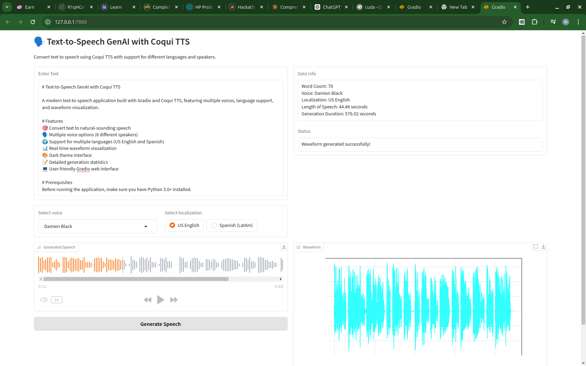

# Text-to-Speech GenAI with Coqui TTS

A modern text-to-speech application built with Gradio and Coqui TTS, featuring multiple voices, language support, and waveform visualization.



video Link = { https://www.kapwing.com/videos/673786cf288ac7a566d6e2a1}

# Features
🎯 Convert text to natural-sounding speech
🗣️ Multiple voice options (6 different speakers)
🌍 Support for multiple languages (US English and Spanish)
📊 Real-time waveform visualization
🎨 Dark theme interface
📝 Detailed generation statistics
💻 User-friendly Gradio web interface

# Prerequisites
Before running the application, make sure you have Python 3.0+ installed.

# Installation

1. clone the repository
```sh
git clone git@github.com:mwihoti/Text-to-Speech-Coqui-TTS.git
cd Text-to-Speech-Coqui-TTS
```

2. Install the required packages:
```sh
pip install -r requirements.txt


```

## Quick Start
1. Run the application:
```sh
python app.py
```
2. Open your web browser and navigate to:
```
http://localhost:7860
```

## 🎤 Available Voices
The application comes with six different voice options:

Daisy Studious
Sofia Hellen
Asya Anara
Eugenio Mataracı
Viktor Menelaos
Damien Black

## 🌐 Language Support
Currently supported languages:

US English
Spanish (Latin America)

## 📝 Usage

Enter your text in the input box
Select a voice from the dropdown menu
Choose your preferred language
Click "Generate Speech" to create the audio
Click "Generate Waveform" to visualize the audio wave
Listen to the generated speech or download the audio file

## 🔍 Features in Detail
Text-to-Speech Generation

Real-time speech synthesis
Multiple voice options
Language selection
Generation time tracking
Word count statistics

Audio Visualization

Waveform generation
Interactive audio player
